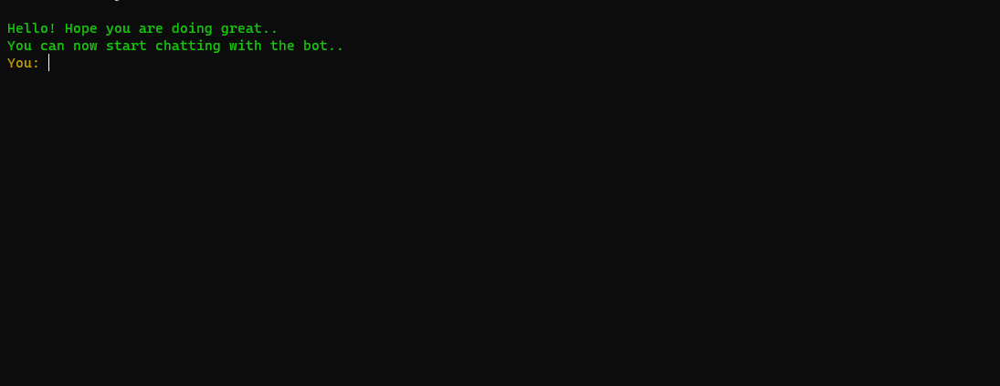

# ChatGPT App (In CLI)

This is a tutorial app done following [Brad traversy's video](https://www.youtube.com/watch?v=1YU83Lw58eo). You would need a working OpenAI key to use ChatGPT. You could create one [here](https://platform.openai.com/account/api-keys).

A small addition to this adaptation is that it does not allow some unsafe words to get posted in the chatgpt query. This ensures that you do not leak some confidential information to chatgpt. 

Please remember to configure `.env` file before starting the app. Entries in the `.env` looks like the following

```
OPENAI_API_KEY=<YOUR_OPENAPI_KEY>
UNSAFE_WORDS=<UNSAFE_WORDS_COMMA_SEPARATED>
```
An example would be

```
OPEN_API_KEY=yourCoMPleTEOpenApIKeyGoesHEre
UNSAFE_WORDS=confidential,private,do not share
```
To start the app, from the root folder, run the following
```console
npm start
```
Started Application looks like this



You can type in your query and press enter to get response. Enjoy !!!